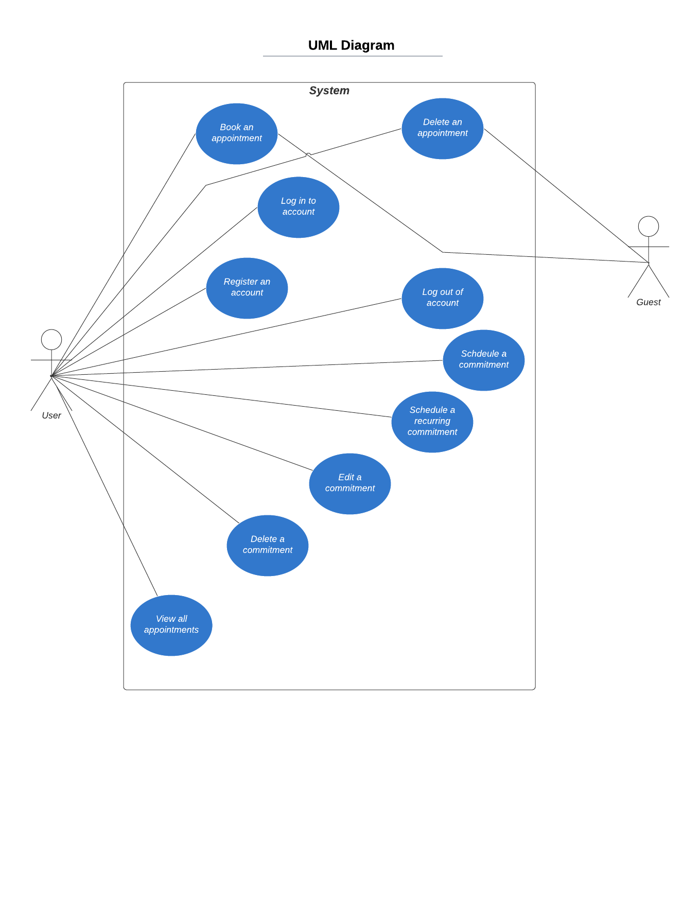

# CMPE 131 
# Team 5 Milestone for Project

## **GitHub Usernames:**   
**lenexagonsalves**   
**Alireza-Mahinparvar**  
**domgutz3**  
**BenG7447**  

## Product Name: **BookMe** 

## Problem Statement:  
Many people have trouble scheduling their days out and run the risk of double booking or missing events. Booking appointments and coordinating events is a tedious task without a single management system. 

## Product Objective:   
The objective of our application is to create a single platform for customers to solve scheduling issues, book appointments, and ease the burden of coordinating appointments. 

## Functional Requirements  
1) System should allow users to add commitments to their availability. 
2) System should check for scheduling conflicts. 
3) System should allow users to delete commitments. 
4) System should allow users to edit commitments. 
5) System should allow guests to schedule appointments. 
6) System should allow guests to delete appointments. 

## Non-functional Requirements
1) System should respond within 5 seconds. 
2) System should run on Windows, Mac, and Linux. 
3) System should relay messages in English. 
4) System should be accurate 100% of the time. 
   
## Use Cases
**UML Use Case Diagram:**     
  

1) Register for an account (user)
2) Log into an account (user)
3) Log out of an account (user)
4) Book an appointment (guest)
5) Delete an appointment (guest)
6) Schedule a commitment (user) 
7) Schedule a recurring commitment (user)
8) Delete a commitment (user)
9) Edit a commitment (user)
10) View all appointments (user)

# **Use Case Descriptions** 
**We wrote descriptions for the following use cases:**  
1) Log into an account 
2) Schedule a commitment
3) Delete an commitment
4) Schedule a recurring commitment
5) Edit an commitment 

# Use Case #1 Name: Log in to an account 

### **Summary:**
A user will be able to log in to their account  
### **Actor(s):**
* The user
### **Preconditions:**
* The user must have opened the website home page
* The user must have previously registered for an account
### **Triggers:**
User follows the "login" link and enters their username and password in the provided web form text boxes.
### **Primary Sequence:**
1) User enters his or her username and password
2) System checks if username and password match
3) System sends user to his or her profile page
### **Primary Postconditions:**
* User will be logged in to their account
* User will be able to change his or her settings
### **Alternate Sequences:**
* User does not have an account yet 
1) System will prompt user to select the “Register” option
2) The System allows user to create new account
* User forgot username/password
1) User should select “Forgot password or username”
2) The system allows the user to recover their username/password
* User enters incorrect credentials
1) System will display a mesage that notifies the user of the issue
2) User should enter their credentials again 

### **Non-functional Requirements:**
* The System responds to each user input within 5 seconds.

### **Glossary:**      
**User** = a person who wants to log in to his or her account    

# Use Case #2 Name: Schedule a commitment
### **Summary:**     
A user who has logged in can select dates to schedule commitments.
### **Actor(s):**
* The user
### **Preconditions:**
* The user has logged in.
### **Triggers:**
User selects the "new" option in their availability settings and selects a date.
### **Primary Sequence:**
1) User selects "new" to schedule the commitment.
2) System checks availability from existing commitments.
3) System shows availability to user.
4) User selects times.
5) System checks conflicts.
6) User saves schedule.
### **Primary Postconditions:**
* User has a new commitment scheduled.
* Guests will not be able to book appointments durring that timeframe
### **Alternate Sequences:**
* User enters conflicting dates
1) The system displays an error message to the user.
2) The system prompts the user to cancel or replace the old commitment with the new one.
### **Non-functional Requirements:**
* The system responds to each user input within 5 seconds.
### **Glossary:**      
**User** = a person with an account who wants to add a commitment to their availability       
**Guest** = a person who wants to schedule an appointment with a user   
**Commitment** = an event occurring outside of appointment scheduling (during which the user is unavailable for appointments)    
**Appointment** = meeting between guest and user   

# Use Case #3 Name: Delete a commitment.

### **Summary:**
A user who is logged in wants to delete a previously created commitment. 
### **Actor(s):**
* The user.
### **Preconditions:**
* The user is logged in. 
* The user has previously created a commitment.
### **Triggers:**
The user selects “edit commitment”. 
### **Primary Sequence:**
1) User selects a commitment from the schedule. 
2) User selects “edit commitment”.
3) User selects “delete commitment”. 
4) System removes commitment from the schedule.
5) User saves schedule. 
### **Primary Postconditions:**
* The user has deleted the desired commitment.
* Guests will now be able to book appointments during that timeframe 
### **Alternate Sequences:**
* System is unable to delete the commitment.
1) System relays an error message. 
### **Non-functional Requirements:** 
* The system responds to each user input within 5 seconds.
* The system should relay messages in English. 
### **Glossary:**
**User** = a person with an account who wants to delete a commitment from his or her availability   
**Guest** = a person who wants to schedule an appointment with a user   
  

      
# Use Case #4 Name: Schedule recurring commitments.
### **Summary:**  
A user who has logged in can select dates with commitments that will be recurring until a determined final date. 
### **Actor(s):**   
* The user
### **Preconditions:**  
* The user has logged in.
### **Triggers:**  
The user selects the "repeat" option when adding a commitment that will be recurring.
### **Primary Sequence:**   
1) User selects dates to schedule a commitment.
2) System checks availability from selected dates.
3) System shows availability to user.
4) User selects times.
5) User selects “repeat”.
6) User indicates date commitment will be recurring.
7) System checks conflicts.
8) User saves schedule.
### **Primary Postconditions:**
* User has a recurring commitment scheduled.
* Guests will not be able to book appointments with the user during these timeframes
### **Alternate Sequences:**   
* User enters conflicting dates after selecting “repeat”.
1) The system displays an error message to the user.
2) The system prompts the user to cancel or replace the commitment for that conflicting time.
### **Non-functional Requirements:**
* The system responds to each user input within 5 seconds.
### **Glossary:**
**User** = a person with an account who wants to add a commitment to his or her availability   
**Guest** = a person who wants to schedule an appointment with a user   
**Commitment** = an event occurring outside of appointment scheduling (during which the user is unavailable for appointments)    
**Appointment** = meeting between guest and user   

# Use Case #5 Name: Edit a commitment

### **Summary:**
A user who is logged in wants to edit a previously created commitment. 

### **Actor(s):**
* The user

### **Preconditions:**
* The user is logged in. 
* The user has a created commitment.

### **Triggers:**
The user selects “edit commitment”. 

### **Primary Sequence:**
1) User selects a commitment. 
2) User selects “edit commitment”.
3) User edits desired fields. 
4) System checks for scheduling conflicts. 
5) User saves schedule. 

### **Primary Postconditions:**
* The user has edited the desired commitment.
* No changes occurred to the commitment. 
### **Alternate Sequences:**
* User enters conflicting dates or times after selecting “edit”.
1) The system displays an error message to the user.
2) The system prompts the user to cancel or replace the commitment for that conflicting time.
### **Non-functional Requirements:** 
* The system responds to each user input within 5 seconds.
* The system should relay messages in English. 

### **Glossary:**    
**User** = a person with an account who wants to edit a commitment in his or her availability      
**Commitment** = an event occurring outside of appointment scheduling (during which the user is unavailable for appointments)    

